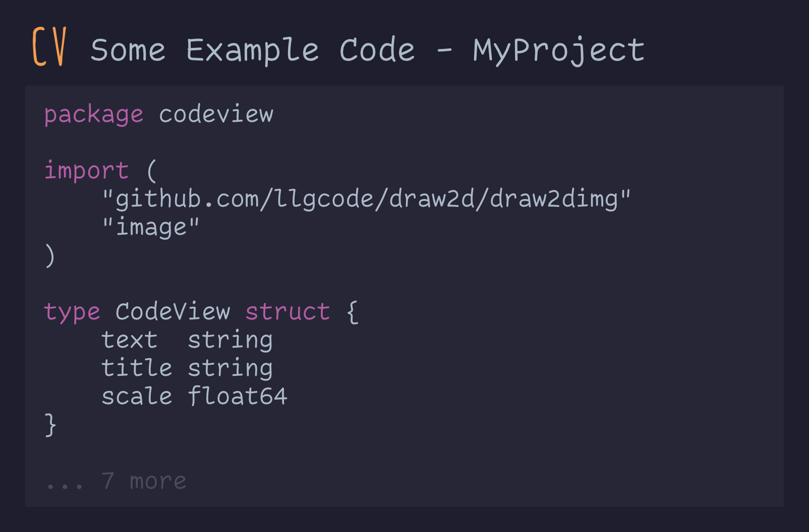

# CodeView
Library for rendering code preview images.

## Example Implementation

```golang
package main

import (
	"github.com/coalaura/codeview"
)

func main() {
	// Set the project name (appended to title, optional)
	codeview.SetProjectName("MyProject")

	// Set the logo (png bytes, required)
	codeview.SetLogo([]byte("..."))

	// Create a new code view
	cv := codeview.NewCodeView()

	// Set the code and title
	cv.SetText(text)
	cv.SetTitle("Some Example Code")

	// Set the scale (optional)
	cv.SetScale(2.0)

	// Render the image to a file
	err := cv.RenderToPng("test.png")
	if err != nil {
		panic(err)
	}
}
```

### Example Image

